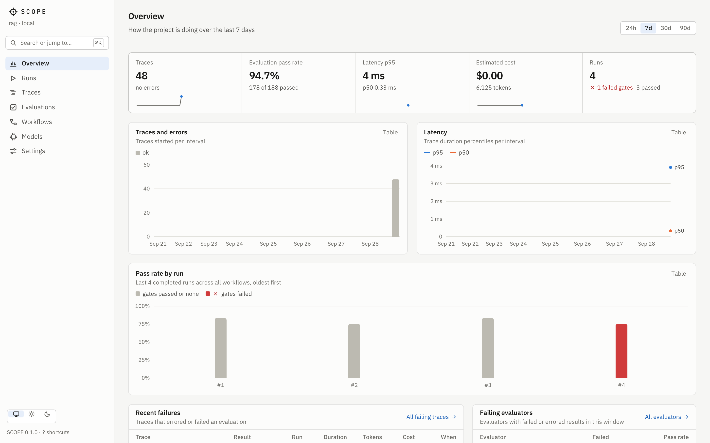
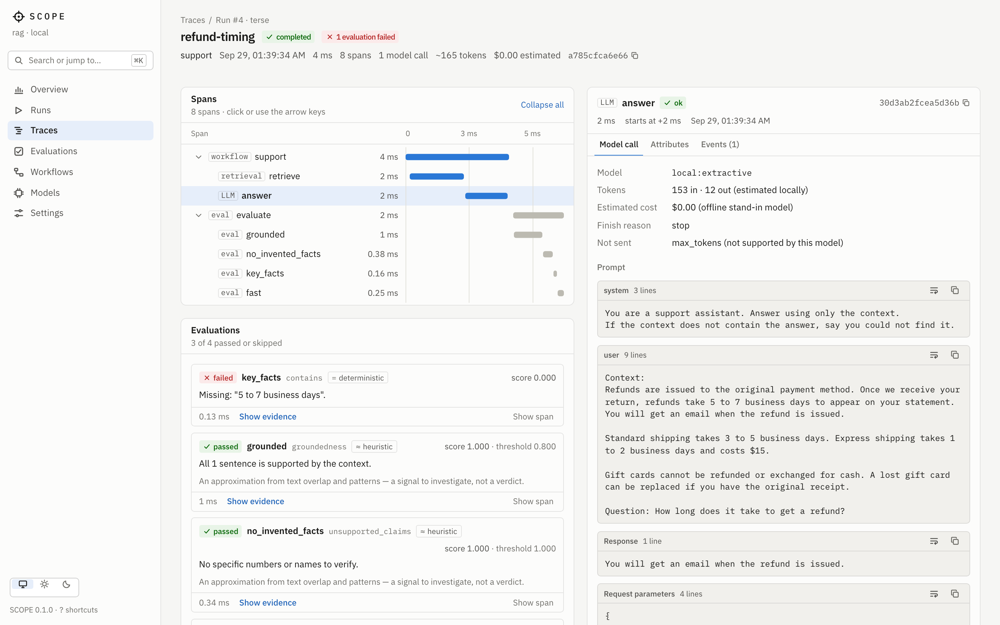
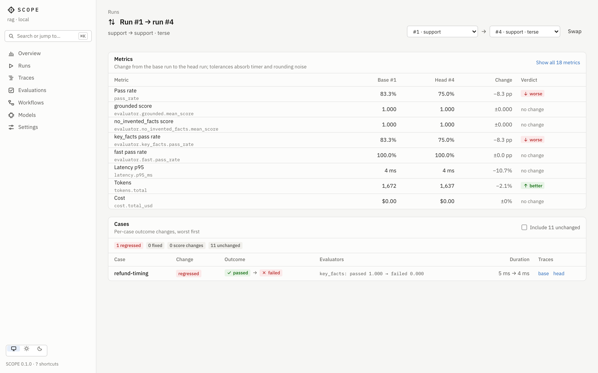
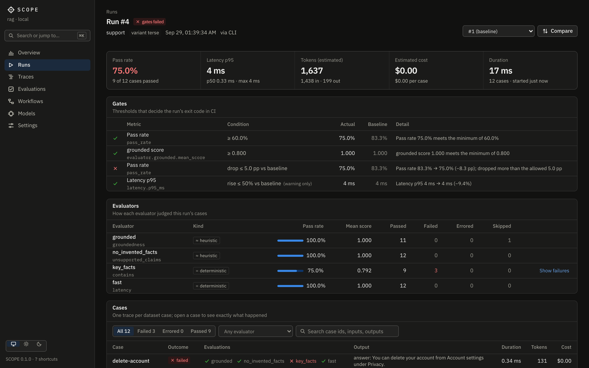

<h1 align="center">SCOPE</h1>

<p align="center"><strong>See what your AI actually does.</strong></p>

<p align="center">
Open-source tracing, evaluation and regression testing for AI workflows.<br>
Local-first, self-hostable, and built to fail the pull request that makes your AI worse.
</p>

<p align="center">
<a href="https://github.com/tanmaytyagii/scope/actions/workflows/ci.yml"></a>
<a href="LICENSE"></a>
</p>



When an LLM feature gives a bad answer, the questions are always the same: what was retrieved,
what prompt was actually sent, which model answered, how long each step took, what it cost — and
whether last week's prompt change made things better or just different. SCOPE answers them with
one data model: every execution is a **trace**, every trace is **evaluated**, and every batch of
evaluated traces is a **run** you can compare with another run or with a **baseline** committed
next to your code.

- **Trace** every step of a workflow — retrievals, model calls, tool calls, your own functions —
  with inputs, outputs, tokens, latency and estimated cost. Instrument existing apps with the SDK.
- **Evaluate** every output with evaluators that say how they judge: deterministic rules,
  heuristic signals, or a model's opinion. Custom evaluators are plain modules.
- **Compare** prompts, models and parameters as variants, metric by metric and case by case.
- **Gate** quality in CI: a pull request that lowers groundedness below your threshold fails,
  with a report of exactly which cases regressed.
- **Keep your data**: SQLite on your laptop or PostgreSQL on your server, secrets redacted before
  storage, no account, no telemetry. Works offline.

## Quickstart

Requires Node.js 22.16+. The packages are not on npm yet, so install from source:

```bash
git clone https://github.com/tanmaytyagii/scope.git && cd scope
npm ci && npm run build
npm link -w @scope-ai/cli          # puts `scope` on your PATH
```

Create a project and run it — no API key needed; the starter uses a deterministic offline model:

```bash
scope init support-bot && cd support-bot
scope run workflows/support.yaml    # run, trace and evaluate 12 cases
scope baseline save                 # make this run the reference for regressions
scope ui --open                     # explore it at http://127.0.0.1:4700
```

Or see a populated dashboard with one command: `docker compose up`, then open
<http://127.0.0.1:4700>.

The [quickstart guide](docs/guides/quickstart.md) walks through it, including switching to a real
model.

## What a regression looks like

Change a parameter — here, answers keep one sentence instead of two — and run again:

```text
$ scope run workflows/support.yaml

Failures
  ✗ refund-timing  e651e31
      key_facts: Missing: "5 to 7 business days".
  ✗ refund-method  4ba1cf6
      key_facts: Missing: "original payment method".
  ✗ delete-account  9287273
      key_facts: Missing: "30 days".

Evaluators
  Evaluator          Kind             Pass                Mean score  Results
  grounded           heuristic      100.0%  ████████████       1.000  11 passed · 1 skipped
  no_invented_facts  heuristic      100.0%  ████████████       1.000  12 passed
  key_facts          deterministic   75.0%  █████████░░░       0.792  9 passed · 3 failed
  fast               deterministic  100.0%  ████████████       1.000  12 passed

Compared with baseline run #1 · ac2f615
  Metric                   Baseline  Current   Change
  Pass rate                   83.3%    75.0%  −8.3 pp  ▼ worse
  key_facts pass rate         83.3%    75.0%  −8.3 pp  ▼ worse

  Cases  1 regressed · 11 unchanged
    ✗ refund-timing  passed → failed (key_facts passed → failed 1.000 → 0.000)

Gates
  ✓ pass_rate ≥ 60.0%  75.0%
  ✓ evaluator.grounded.mean_score ≥ 0.800  1.000
  ✗ pass_rate drop ≤ 5.0 pp vs baseline  75.0% (baseline 83.3%)

FAILED  run #5 · 12 cases in 18 ms
```

The exit code is 1, so CI fails. Open the failing case and the trace explorer shows why: the
right fact was retrieved, and the one-sentence answer dropped it.



## Workflows

A workflow is YAML: steps, a dataset, evaluators and gates. Everything is validated — with
file, line and column — before anything runs.

```yaml
version: 1
name: support
params:
  model: anthropic:claude-sonnet-5        # or openai:gpt-5, ollama:llama3.1, local:extractive
variants:
  gpt: { model: openai:gpt-5 }
steps:
  - id: retrieve
    type: retrieve                         # BM25 over local docs
    with: { query: "{{ inputs.question }}", corpus: ../docs/*.md, top_k: 3 }
  - id: answer
    type: llm
    with:
      model: "{{ params.model }}"
      prompt: "Context:\n{{ steps.retrieve.output.text }}\n\nQuestion: {{ inputs.question }}"
outputs:
  answer: "{{ steps.answer.output.text }}"
dataset: ../datasets/support.jsonl
evaluators:
  - { name: grounded, type: groundedness }
  - { name: key_facts, type: contains }
  - name: helpful
    type: llm_judge
    with: { model: anthropic:claude-opus-5, rubric: "Resolves the question using only the context." }
gates:
  - { metric: pass_rate, min: 0.9 }
  - { metric: evaluator.grounded.mean_score, max_decrease: 0.05 }
```

Steps: `llm` (OpenAI, Anthropic, any OpenAI-compatible endpoint, offline stand-ins), `retrieve`,
`transform`, and `function` — your own JavaScript or TypeScript, whose tool calls, retrievals
and model calls are traced too. Guide: [workflows](docs/guides/workflows.md).

## Evaluators say how they judge

| Kind | Built-in evaluators | Trust it as |
| --- | --- | --- |
| deterministic | `exact_match`, `contains`, `not_contains`, `regex`, `json` (with JSON Schema), `latency`, `tokens`, `cost` | A fact about the output |
| heuristic | `similarity`, `groundedness`, `unsupported_claims`, `relevance` | A signal to investigate, not a verdict |
| model | `llm_judge` (rubric), `embedding_similarity` | An opinion, recorded with the judge's reasoning |

Every result has a reason and its evidence. Each evaluator's documentation says how it can be
wrong. Guide: [evaluators](docs/guides/evaluators.md).

## In CI

```yaml
# .github/workflows/scope.yml
on: pull_request
jobs:
  evaluate:
    runs-on: ubuntu-latest
    steps:
      - uses: actions/checkout@v4
      - uses: tanmaytyagii/scope/integrations/github-action@main
        env:
          ANTHROPIC_API_KEY: ${{ secrets.ANTHROPIC_API_KEY }}
```

Each workflow runs against its committed baseline; the job summary gets a report of every metric
and regressed case, failed gates become annotations, and the job fails on a regression. Because
baselines are files, a pull request that intentionally changes quality shows the new numbers in
its diff. Guide: [CI and regressions](docs/guides/ci.md).



## Trace your application

```ts
import { createTracer } from '@scope-ai/sdk';

const tracer = createTracer();                         // sends to SCOPE_URL (a scope ui or scope server)

await tracer.trace('answer-question', { input: { question } }, async () => {
  const docs = await tracer.span('search', { kind: 'retrieval' }, () => search(question));
  return tracer.span('generate', { kind: 'llm' }, async (span) => {
    const res = await openai.chat.completions.create({ model: 'gpt-5-mini', messages });
    span.recordModelCall({
      provider: 'openai', model: 'gpt-5-mini',
      usage: { inputTokens: res.usage.prompt_tokens, outputTokens: res.usage.completion_tokens },
    });
    return res.choices[0].message.content;
  });
});
```

The exporter batches in the background, bounds its memory, and never breaks your application
when the server is down. Other languages can post to the same
[ingestion API](docs/guides/api.md#ingestion). Guide: [tracing](docs/guides/tracing.md).

## Self-hosting

`scope ui` is a local dashboard with no authentication, bound to 127.0.0.1. For a team,
`scope server` serves every project with project-scoped API keys, JSON logs, health and
Prometheus endpoints — from the Docker image or directly:

```bash
docker build -t scope .
docker run -d -p 4700:4700 -e SCOPE_DATABASE_URL=postgres://… scope
docker exec <container> scope keys create --project support-bot --name dashboard --scope read
```

Guide: [self-hosting](docs/guides/self-hosting.md).



## How it is built

```text
cli ──▶ engine ──▶ evaluators, providers, sdk, config ──▶ core
 └────▶ server ──▶ storage (SQLite | PostgreSQL), protocol ──▶ core
web (React dashboard) ──▶ protocol (types), core (formatting)
```

A TypeScript monorepo: `core` holds the domain model and pure logic, `engine` executes workflows,
`storage` is the only package that knows SQL, `server` the only one that knows HTTP, and the
dashboard talks to the server only through the versioned `/api/v1` contract, whose OpenAPI
document is generated from the same schemas the server validates against. Details:
[architecture](docs/architecture.md) and [design decisions](docs/decisions/).

## Documentation

- Guides: [quickstart](docs/guides/quickstart.md) · [workflows](docs/guides/workflows.md) ·
  [evaluators](docs/guides/evaluators.md) · [configuration](docs/guides/configuration.md) ·
  [tracing](docs/guides/tracing.md) · [CI](docs/guides/ci.md) ·
  [self-hosting](docs/guides/self-hosting.md) · [CLI](docs/guides/cli.md) ·
  [HTTP API](docs/guides/api.md)
- Examples, all runnable offline: [RAG support assistant](examples/rag) ·
  [ticket triage with function steps](examples/triage) · [SDK tracing](examples/sdk-tracing)
- Design: [product](docs/product.md) · [architecture](docs/architecture.md) ·
  [design system](docs/design-system.md)

## Status

SCOPE is pre-1.0 (`0.1.0`) and under active development. What is described above works and is
tested in CI: unit, integration and CLI tests on SQLite and PostgreSQL, end-to-end dashboard
tests with accessibility checks, an install test of the packed packages, a Docker image test, and
a self-test of the GitHub Action.

Not there yet, in [roadmap](docs/roadmap.md) order: npm packages and tagged action releases, a
Python SDK, automatic instrumentation of the OpenAI and Anthropic clients, OpenTelemetry (OTLP)
ingestion, pull-request comments, retention policies, and user accounts.

## Contributing

Issues and pull requests are welcome — see [CONTRIBUTING.md](CONTRIBUTING.md) for the
development setup (`npm ci && npm run check`) and conventions, and
[SECURITY.md](SECURITY.md) for reporting vulnerabilities.

## License

[Apache-2.0](LICENSE).
